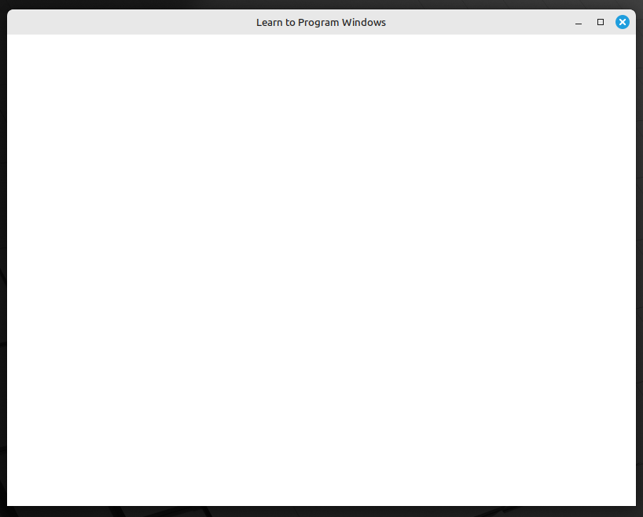

# Windows Games on Linux
A compatibility layer for running Windows software and games on Linux

## What can it do?
The project is currently in the initial stage of development, so not much is possible. You can test out a simple C WinAPI demo from Microsoft by compiling it to a native Linux executable with my implementation of WinAPI libraries:

```c
#include <windows.h>

LRESULT CALLBACK WindowProc(HWND hWnd, UINT uMsg, WPARAM wParam, LPARAM lParam);

int WINAPI WinMain(HINSTANCE hInstance, HINSTANCE hPrevInstance, PWSTR pCmdLine, int nCmdShow) {
  const char CLASS_NAME[] = "Sample Window Class";

  WNDCLASS wc = {};
  wc.lpfnWndProc = WindowProc;
  wc.hInstance = hInstance;
  wc.lpszClassName = CLASS_NAME;

  RegisterClass(&wc);

  HWND hwnd = CreateWindowEx(0, CLASS_NAME, "Learn to Program Windows", WS_OVERLAPPEDWINDOW, CW_USEDEFAULT, CW_USEDEFAULT, CW_USEDEFAULT, CW_USEDEFAULT, NULL, NULL, hInstance, NULL);
  if (hwnd == NULL) {
    return 0;
  }

  ShowWindow(hwnd, nCmdShow);

  MSG msg = {};
  while (GetMessage(&msg, NULL, 0, 0) > 0) {
    TranslateMessage(&msg);
    DispatchMessage(&msg);
  }

  return 0;
}

LRESULT CALLBACK WindowProc(HWND hwnd, UINT uMsg, WPARAM wParam, LPARAM lParam) {
  switch (uMsg) {
  case WM_DESTROY:
    PostQuitMessage(0);
    return 0;

  case WM_PAINT: {
    PAINTSTRUCT ps;
    HDC hdc = BeginPaint(hwnd, &ps);

    FillRect(hdc, &ps.rcPaint, (HBRUSH)(COLOR_WINDOW + 1));

    EndPaint(hwnd, &ps);
    return 0;
  }
  }

  return DefWindowProc(hwnd, uMsg, wParam, lParam);
}
```

Save it in the project's root directory for example and compile it with the following command:
```bash
gcc '<filename.c>' utils/gui_app_launcher.c libraries/user32/*.c libraries/gdi32/*.c -I"include" -I"libraries/common" -lX11 -o '<executable_filename>'
```

And then run it with: `./<executable_filename>`

The following window should appear:

